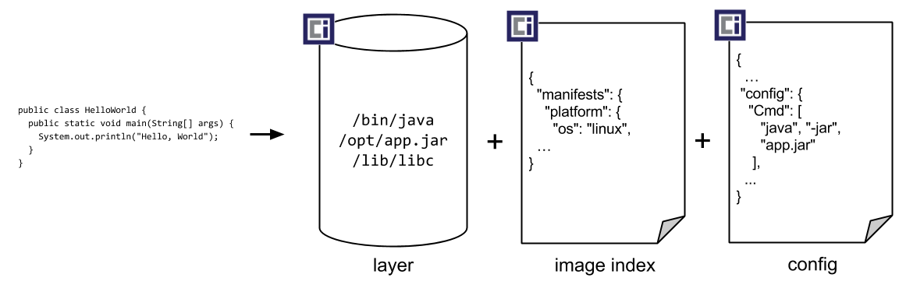
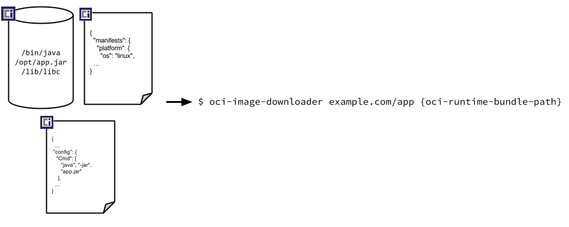
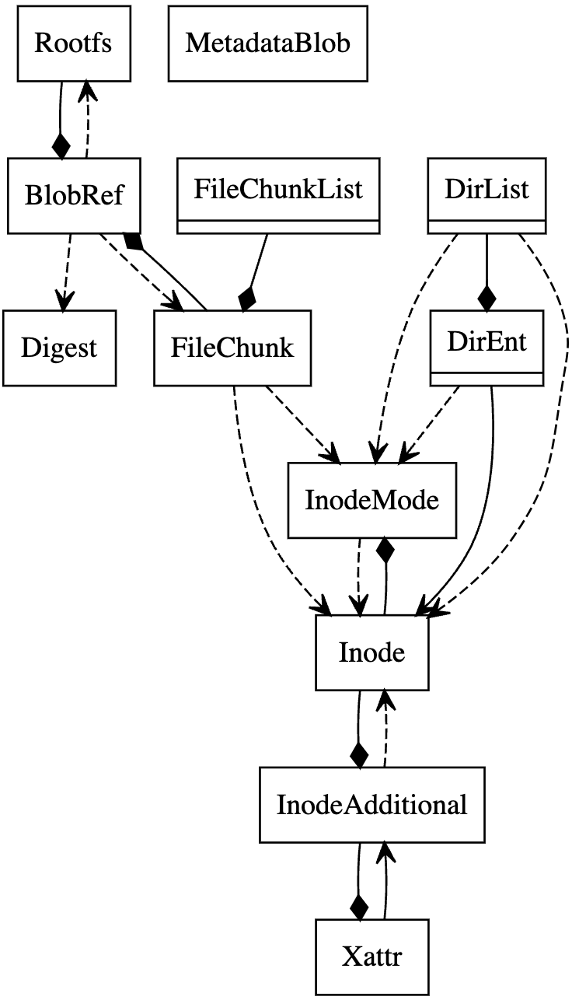

# PuzzleFS 源码分析报告

PuzzleFS 项目地址：https://github.com/project-machine/puzzlefs

> PuzzleFS 号称是`下一代 Linux 容器文件系统`，采用 Rust 语言编写，具有`快速镜像构建`、`直接挂载支持`、`内存安全保证`等功能。

---

## 介绍

思科开发者 `Ariel Miculas` 在[内核邮件列表](https://lore.kernel.org/rust-for-linux/20230609063118.24852-1-amiculas@cisco.com/)中，发布了用 Rust 写的 PuzzleFS 文件系统驱动，以征求其他开发者的意见，目前这一驱动程序处于“概念验证”阶段。

PuzzleFS 是一种`只读`的文件系统，与 `Open Container Initiative (OCI) v2 image specification` 的设计目标相符，它使用内容定义进行分块，并且使用内容寻址的数据存储，旨在解决现有 OCI 格式的限制。

> OCI 镜像规范的第一个版本存在许多问题，这些问题的根源都是来自依赖 tar 存档来保存文件系统中的层，事实上 `tar 不适合解决容器文件系统问题`。

PuzzleFS 旨在解决 tar 的问题。文件系统镜像本身由一组放置在底层文件系统上的文件组成。与 `OCI 镜像格式一样`，存在一个顶级 `index.json` 文件，其中包含一组标签，每个标签代表某一个版本的文件系统，并指向一个清单文件（`manifest file`）。清单文件又指向镜像配置和存储在实际镜像层中的数据。其他所有内容都存储为 `blobs/sha256` 目录中的一组 `blob`。

文件系统中的大多数数据都被分成可变大小的块（`chunk`），以内容的 `SHA256` 哈希作为文件名来存储为 `blob`。这个分块动作本身是使用 `FastCDC 算法`进行的，该算法查找 "切割点（`cut points`）"，把数据流分为不同大小的 `blob`。任何一个特定的流（例如文件的内容）都可以分成`五个`或`五十个块`，这取决于如何确定这些切割点；然后，每个块都以不同的 `blob` 方式落在 `blobs/sha256` 下，并将其哈希添加到清单中。

---

## 环境准备

### 实验环境信息

* CPU: Apple M1
* 宿主机OS：macOS Sonoma 14.1.1
* 虚拟机：使用 OrbStack 安装 ubuntu 23.10，选用 OrbStack 理由看 这里：https://docs.orbstack.dev/

### Ubuntu 环境准备

* 设置 Rustup 镜像， 修改配置 ~/.zshrc or ~/.bashrc

```bash
export RUSTUP_DIST_SERVER="https://rsproxy.cn"
export RUSTUP_UPDATE_ROOT="https://rsproxy.cn/rustup"
```

* 安装 Rust（请先完成步骤一的环境变量导入并 source rc 文件或重启终端生效）

```bash
curl --proto '=https' --tlsv1.2 -sSf https://rsproxy.cn/rustup-init.sh | sh
```

* 设置 crates.io 镜像， 修改配置 ~/.cargo/config，已支持git协议和sparse协议，>=1.68 版本建议使用 sparse-index，速度更快。

```bash
cat <<EOF > ~/.cargo/config
[source.crates-io]
replace-with = 'rsproxy-sparse'
[source.rsproxy]
registry = "https://rsproxy.cn/crates.io-index"
[source.rsproxy-sparse]
registry = "sparse+https://rsproxy.cn/index/"
[registries.rsproxy]
index = "https://rsproxy.cn/crates.io-index"
[net]
git-fetch-with-cli = true
EOF
```

* 修改 Ubuntu 源，加速依赖包更新速度

```bash
sudo cp /etc/apt/sources.list /etc/apt/sources.list.bak
sudo sed -i 's/ports.ubuntu.com/mirrors.ustc.edu.cn/' /etc/apt/sources.list
```

* 安装 Linux 内核相关依赖包

```bash
## first Update
sudo apt update

## Install dependency packages
sudo apt -y install \
  binutils build-essential libtool texinfo \
  gzip zip unzip patchutils curl git \
  make cmake ninja-build automake bison flex gperf \
  grep sed gawk bc \
  zlib1g-dev libexpat1-dev libmpc-dev \
  libglib2.0-dev libfdt-dev libpixman-1-dev libelf-dev libssl-dev

## Install the LLVM
sudo apt -y install clang-format clang-tidy clang-tools clang clangd libc++-dev libc++1 libc++abi-dev libc++abi1 libclang-dev libclang1 liblldb-dev libllvm-ocaml-dev libomp-dev libomp5 lld lldb llvm-dev llvm-runtime llvm python3-clang
```

* 安装 PuzzleFS 需要用到的工具

```bash
sudo apt install -y capnproto skopeo umoci tree jq
```

---

## 编译和挂载 PuzzleFS 镜像

### 测试文件准备

```bash
# 1. 创建相关测试目录
mkdir -p /tmp/example-rootfs/algorithms /tmp/mounted-image

# 2. 创建测试文件
echo "Binary Search" > /tmp/example-rootfs/algorithms/binary-search.txt
echo "test" > /tmp/example-rootfs/algorithms/test.txt
echo "lorem ipsum" > /tmp/example-rootfs/lorem_ipsum.txt
tree /tmp/example-rootfs
```

### 编译 PuzzleFS 源码

```bash
cargo build --release 
```

### 构建 PuzzleFS 镜像

```bash
target/release/puzzlefs build -c /tmp/example-rootfs /tmp/puzzlefs-image puzzlefs_example
```

运行成功会产生以下信息，`build` 命令内部实际通过 Linux 内核工具模块 `fs-verity` 实现。

```bash
puzzlefs image manifest digest: 743b08e98105e637c47adb80a17ba21ed12eb31523a056a0970ff687551904d7
```

### 挂载 PuzzleFS 镜像

* 通过 PuzzleFS 工具挂载到系统

```bash
target/release/puzzlefs mount /tmp/puzzlefs-image puzzlefs_example /tmp/mounted-image
```

* 验证挂载结果

```bash
# 1. 验证挂载结果
mount|grep fuse

# 若显示结果出现 /dev/fuse on /tmp/mounted-image，则代表镜像挂载成功
/dev/fuse on /tmp/mounted-image type fuse (rw,nosuid,nodev,relatime,user_id=501,group_id=501)

# 2. 验证挂载目录情况是否与 /tmp/example-rootfs 内容一致
tree /tmp/mounted-image

# 若显示结果如下，则代表文件挂载成功
/tmp/mounted-image
├── algorithms
│   ├── binary-search.txt
│   └── test.txt
└── lorem_ipsum.txt

# 3. 查看 PuzzleFS 文件组织结构
tree /tmp/puzzlefs-image/

# 显示内容如文章介绍所述
/tmp/puzzlefs-image/
├── blobs
│   └── sha256
│       ├── 04718eb872552abfdf44d563aa09bdf89343950a364d9ff555fc6e3657d383b4
│       ├── 73ee73b991e91697ec02c990de8401d7c316d3392ec394be7162195dc783c9b5
│       └── e10090d2c24f6a299ad6fee3e6f345a784918bc89530a1329c92c40de71a9c47
├── index.json
└── oci-layout

# 4. 查看 /tmp/puzzlefs-image/index.json 内容
cat /tmp/puzzlefs-image/index.json | jq .

# manifests 里的 digest 确实指示到 /tmp/puzzlefs-image/blobs/sha256 下
{
  "schemaVersion": -1,
  "manifests": [
    {
      "digest": "sha256:04718eb872552abfdf44d563aa09bdf89343950a364d9ff555fc6e3657d383b4",
      "size": 272,
      "media_type": "application/vnd.puzzlefs.image.rootfs.v1",
      "annotations": {
        "org.opencontainers.image.ref.name": "puzzlefs_example"
      }
    }
  ],
  "annotations": {}
}

# 5. 复制内容验证文件
mkdir -p ~/puzzlefs/format
cp -f puzzlefs-lib/src/format/*.capnp ~/puzzlefs/format

# 6. 验证 PuzzleFS 文件系统 metadata 内容，注意 Rootfs 文件在 /tmp/puzzlefs-image/index.json 的 digest 字段已提供
capnp convert binary:json ~/puzzlefs/format/manifest.capnp Rootfs < /tmp/puzzlefs-image/blobs/sha256/04718eb872552abfdf44d563aa09bdf89343950a364d9ff555fc6e3657d383b4

# 这里可以看到文件的压缩开发、偏移以及文件验证信息等元数据均记录在此文件
{ "metadatas": [{ "digest": [115, 238, 115, 185, 145, 233, 22, 151, 236, 2, 201, 144, 222, 132, 1, 215, 195, 22, 211, 57, 46, 195, 148, 190, 113, 98, 25, 93, 199, 131, 201, 181],
    "offset": "0",
    "compressed": false }],
  "fsVerityData": [
    { "digest": [115, 238, 115, 185, 145, 233, 22, 151, 236, 2, 201, 144, 222, 132, 1, 215, 195, 22, 211, 57, 46, 195, 148, 190, 113, 98, 25, 93, 199, 131, 201, 181],
      "verity": [175, 40, 167, 26, 25, 10, 180, 65, 203, 152, 77, 163, 62, 196, 210, 184, 253, 43, 13, 128, 130, 115, 124, 42, 166, 42, 113, 75, 36, 144, 91, 6] },
    { "digest": [225, 0, 144, 210, 194, 79, 106, 41, 154, 214, 254, 227, 230, 243, 69, 167, 132, 145, 139, 200, 149, 48, 161, 50, 156, 146, 196, 13, 231, 26, 156, 71],
      "verity": [224, 250, 182, 10, 67, 174, 109, 47, 213, 23, 121, 57, 246, 130, 220, 70, 235, 42, 198, 50, 201, 130, 116, 91, 120, 12, 232, 61, 237, 227, 113, 94] } ],
  "manifestVersion": "2" }

# 7. 验证 PuzzleFS 文件系统 inode 内容
capnp convert binary:json ~/puzzlefs/format/metadata.capnp InodeVector < /tmp/puzzlefs-image/blobs/sha256/73ee73b991e91697ec02c990de8401d7c316d3392ec394be7162195dc783c9b5

# 可以看到日常看到的 ls -lat 命令查看的文件 dir、file 及对应的归属用户和权限都保存在这个文件里
{"inodes": [
  { "ino": "1",
    "mode": {"dir": {
      "entries": [
        { "ino": "2",
          "name": [97, 108, 103, 111, 114, 105, 116, 104, 109, 115] },
        { "ino": "3",
          "name": [108, 111, 114, 101, 109, 95, 105, 112, 115, 117, 109, 46, 116, 120, 116] } ],
      "lookBelow": false }},
    "uid": 501,
    "gid": 501,
    "permissions": 493 },
  { "ino": "2",
    "mode": {"dir": {
      "entries": [
        { "ino": "4",
          "name": [98, 105, 110, 97, 114, 121, 45, 115, 101, 97, 114, 99, 104, 46, 116, 120, 116] },
        {"ino": "5", "name": [116, 101, 115, 116, 46, 116, 120, 116]} ],
      "lookBelow": false }},
    "uid": 501,
    "gid": 501,
    "permissions": 493 },
  { "ino": "3",
    "mode": {"file": [{ "blob": {
        "digest": [225, 0, 144, 210, 194, 79, 106, 41, 154, 214, 254, 227, 230, 243, 69, 167, 132, 145, 139, 200, 149, 48, 161, 50, 156, 146, 196, 13, 231, 26, 156, 71],
        "offset": "0",
        "compressed": false },
      "len": "12" }]},
    "uid": 501,
    "gid": 501,
    "permissions": 420 },
  { "ino": "4",
    "mode": {"file": [{ "blob": {
        "digest": [225, 0, 144, 210, 194, 79, 106, 41, 154, 214, 254, 227, 230, 243, 69, 167, 132, 145, 139, 200, 149, 48, 161, 50, 156, 146, 196, 13, 231, 26, 156, 71],
        "offset": "12",
        "compressed": false },
      "len": "14" }]},
    "uid": 501,
    "gid": 501,
    "permissions": 420 },
  { "ino": "5",
    "mode": {"file": [{ "blob": {
        "digest": [225, 0, 144, 210, 194, 79, 106, 41, 154, 214, 254, 227, 230, 243, 69, 167, 132, 145, 139, 200, 149, 48, 161, 50, 156, 146, 196, 13, 231, 26, 156, 71],
        "offset": "26",
        "compressed": false },
      "len": "5" }]},
    "uid": 501,
    "gid": 501,
    "permissions": 420 } ]}
```

> 至此，PuzzleFS 镜像则准备完成，接下来，就可以开始从源码级别解刨 PuzzleFS 实现。

---

## 解刨前，需了解的知识

### [Image Format Specification](https://github.com/opencontainers/image-spec/blob/main/spec.md)

OCI manifest主要由一个或多个文件列表（组成一个完整的可运行的文件系统）、索引和配置等元数据组成。其中，配置文件包含应用参数、环境变量等信息。索引文件主要是文件清单列表描述，不同平台可能会所有差异。



OCI 镜像构建完成后，可通过名称方式发现和下载镜像，以及通过哈希方式进行验证，通过签名进行信任，并解压到 OCI 运行时中。



OCI 规范主要包括下面这些组件：
* Image Manifest - 有关容器镜像文件清单说明
* Image Index - 有关 Manifest 索引列表说明
* Image Layout - 有关镜像中的文件系统布局说明
* Filesystem Layer - 有关容器文件系统的变化说明
* Image Configuration - 有关镜像的配置说明
* Conversion - 有关转换如何发生的说明
* Artifacts Guidance - 除 OCI 镜像之外的打包规范说明
* Descriptor - 有关类型、元数据和内容地址等的说明

## PuzzleFS 源码分析

该工程主要包含`puzzlefs-lib`库和`exe`可执行两部分：

* `puzzlefs-lib`：PuzzleFS 库的实现
  - `format`：用于 PuzzleFS 格式的序列化和反序列化
  - `builder`：用于构建 PuzzleFS 镜像
  - `extractor`：用于解压 PuzzleFS 镜像
  - `reader`： 用于将 PuzzleFS 镜像挂载到 FUSE（文件系统）的模块。
* `exe/`：可执行文件封装主要是对一些命令和库进行组合，将其整合在一起。这个封装没有什么特别需要解读的地方，因为它只是简单地将相关功能集成在一起，方便用户使用。


### PuzzleFS 格式

PuzzleFS 主要由两部分组成：一个用于存储 inode 信息的元数据格式，以及由各种分块算法定义的实际文件系统数据块。其中，所有枚举值均编码为 u32；所有编码均为小端。

所有 PuzzleFS 块均由以下结构体封装：

```rust
enum hash {
  sha256,
}

typedef hash_value byte[32] // 对于 sha256

enum blob_type {
  root,
  metadata,
  file,
}

type puzzlefs_blob {
  enum hash;
  u64 references_len;
  hash_value references[];
  blob_type type;
  //  followed by the actual blob
}
```

> 下面通过一张 UML 图来解读 `format/types.rs` 文件系统组件的关系




#### 根文件系统（Rootfs）的结构体定义

```rust
pub struct Rootfs {
    pub metadatas: Vec<BlobRef>,
    pub fs_verity_data: VerityData,
    pub manifest_version: u64,
}
```

> 用于描述一个 Rootfs 实例，其中包含了文件系统的元数据、完整性数据和清单版本号。这有助于系统和应用程序正确地处理和验证根文件系统的内容。

结构体包含以下成员：

1. `metadatas`：一个`Vec<BlobRef>`类型的成员，表示根文件系统的元数据。`BlobRef`可能是一个指向文件系统元数据的引用或指针。
2. `fs_verity_data`：一个`VerityData`类型的成员，表示文件系统的完整性数据。`VerityData`可能是一个用于验证文件系统数据完整性的结构体或类。
3. `manifest_version`：一个`u64`类型的成员，表示清单（manifest）的版本。这个版本号用于识别和区分不同的清单版本。


#### Blob 引用（BlobRef）的结构体定义

```rust
pub struct BlobRef {
    pub digest: [u8; SHA256_BLOCK_SIZE],
    pub offset: u64,
    pub compressed: bool,
}
```

> 用于文件系统中引用和标识 BLOB 数据。通过存储 BLOB 的哈希值、偏移量和压缩状态，这个结构体为文件系统的管理和操作提供了有关 BLOB 信息的基本概述。

结构体包含以下成员：

1. `digest`：一个字节数组（`[u8; SHA256_BLOCK_SIZE]`），用于存储 BLOB 的哈希值。SHA256 是一种加密哈希算法，用于生成一个固定长度的哈希值。这个字节数组的长度为 SHA256 块大小，通常为 64 字节。
2. `offset`：一个 `u64` 类型的成员，表示 BLOB 在文件系统中的偏移量。这个偏移量用于定位 BLOB 在文件系统中的位置。
3. `compressed`：一个布尔值（`bool` 类型），表示 BLOB 是否已压缩。如果为 `true`，则表示 BLOB 已压缩；如果为 `false`，则表示 BLOB 未压缩。

#### inode（节点）的结构体定义

```rust
pub struct Inode {
    pub ino: Ino,
    pub mode: InodeMode,
    pub uid: u32,
    pub gid: u32,
    pub permissions: u16,
    pub additional: Option<InodeAdditional>,
}
```

> 用于表示文件系统中的 inode，包含了识别和描述 inode 所需的基本信息。这有助于管理和操作文件系统中的文件和目录。

结构体包含以下成员：
1. `ino`：一个 `Ino` 类型的成员，表示 inode 的唯一标识符。inode 是文件系统中的一个基本概念，用于标识文件和目录。
2. `mode`：一个 `InodeMode` 类型的成员，表示 inode 的模式。`InodeMode` 可能是一个枚举类型，用于表示 inode 是文件还是目录，以及文件或目录的权限设置。
3. `uid`：一个 `u32` 类型的成员，表示 inode 所属的用户 ID。用户 ID 用于识别文件或目录的所有者。
4. `gid`：一个 `u32` 类型的成员，表示 inode 所属的组 ID。组 ID 用于识别文件或目录的所有者所属的组。
5. `permissions`：一个 `u16` 类型的成员，表示 inode 的权限。这些权限通常包括读、写和执行权限，用于控制用户和组对文件或目录的访问。
6. `additional`：一个 `Option<InodeAdditional>` 类型的成员，表示额外的 inode 信息。`InodeAdditional` 可能是一个包含更多详细信息的结构体或类。这个选项值为 `None` 时，表示没有额外的 inode 信息。


#### 元数据 BLOB（MetadataBlob）的结构体定义

```rust
pub struct MetadataBlob {
    reader: message::TypedReader<
        ::capnp::serialize::BufferSegments<Mmap>,
        crate::metadata_capnp::inode_vector::Owned,
    >,
}
```

> 用于表示一个元数据 BLOB，包含了读取和解析元数据所需的信息。这个结构体通常用于处理和分析文件系统中的元数据，以便更好地管理和操作文件。

结构体只有一个成员 `reader`：

这是一个 `message::TypedReader` 类型的成员，用于读取和解析元数据 BLOB。`TypedReader` 是 `Cap'n Proto` 序列化库中的一个类型，用于读取和处理特定类型的数据。

`::capnp::serialize::BufferSegments<Mmap>` 是一个泛型类型，表示用于存储元数据的内存映射（`Mmap`）缓冲区。`Mmap` 是一种内存映射文件的技术，可以将文件内容映射到内存中，以便更快地访问和处理文件数据。

`crate::metadata_capnp::inode_vector::Owned` 是一个泛型类型，表示元数据 BLOB 中的 inode 向量。inode 向量可能是一个包含 inode 结构体的列表或数组，用于存储文件系统中的元数据。
